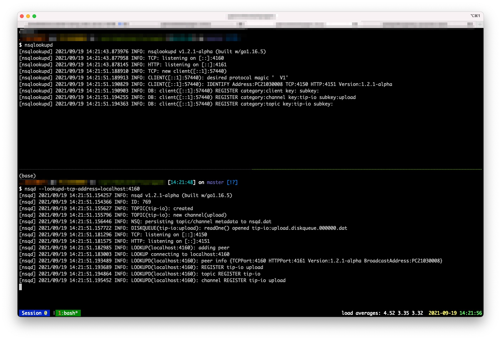

# NSQ

[](https://github.com/golang-queue/nsq/actions/workflows/lint.yml)
[](https://github.com/golang-queue/nsq/actions/workflows/testing.yml)
[](https://codecov.io/gh/golang-queue/nsq)

NSQ as backend with [Queue package](https://github.com/golang-queue/queue) (A realtime distributed messaging platform)



## Setup

start the NSQ lookupd

```sh
nsqlookupd
```

start the NSQ server

```sh
nsqd --lookupd-tcp-address=localhost:4160
```

start the NSQ admin dashboard

```sh
nsqadmin --lookupd-http-address localhost:4161
```

## Testing

```sh
go test -v ./...
```

## Example

```go
package main

import (
  "context"
  "encoding/json"
  "fmt"
  "log"
  "time"

  "github.com/golang-queue/nsq"
  "github.com/golang-queue/queue"
)

type job struct {
  Message string
}

func (j *job) Bytes() []byte {
  b, err := json.Marshal(j)
  if err != nil {
    panic(err)
  }
  return b
}

func main() {
  taskN := 100
  rets := make(chan string, taskN)

  // define the worker
  w := nsq.NewWorker(
    nsq.WithAddr("127.0.0.1:4150"),
    nsq.WithTopic("example"),
    nsq.WithChannel("foobar"),
    // concurrent job number
    nsq.WithMaxInFlight(10),
    nsq.WithRunFunc(func(ctx context.Context, m queue.QueuedMessage) error {
      var v *job
      if err := json.Unmarshal(m.Bytes(), &v); err != nil {
        return err
      }
      rets <- v.Message
      return nil
    }),
  )

  // define the queue
  q := queue.NewPool(
    10,
    queue.WithWorker(w),
  )
  defer q.Release()

  // assign tasks in queue
  for i := 0; i < taskN; i++ {
    go func(i int) {
      if err := q.Queue(&job{
        Message: fmt.Sprintf("handle the job: %d", i+1),
      }); err != nil {
        log.Fatal(err)
      }
    }(i)
  }

  // wait until all tasks done
  for i := 0; i < taskN; i++ {
    fmt.Println("message:", <-rets)
    time.Sleep(50 * time.Millisecond)
  }
}
```
